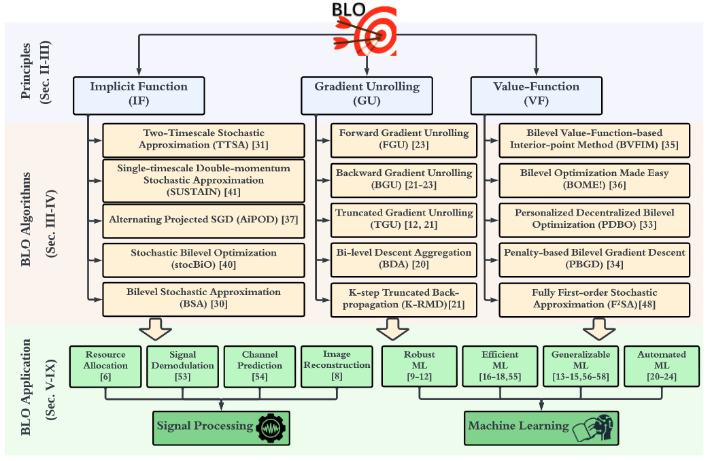

# A Toolbox for Bi-level Optimization (BLO)

BLO-Toolbox is an extensive [PyTorch](https://pytorch.org)-based toolbox designed to facilitate the exploration and development of bi-level optimization (BLO) applications in machine learning and signal processing. The repository is associated with the tutorial paper, "An Introduction to Bi-level Optimization: Foundations and Applications in Signal Processing and Machine Learning." The toolbox supports a number of **large-scale** applications including adversarial training, model pruning, wireless resource allocation, and invariant representation learning. It contains code, tools, and examples that are built upon state-of-the-art methods.

## Introduction

Bi-level optimization (BLO) has a growing presence in the fields of machine learning and signal processing. It serves as a bridge between traditional optimization techniques and novel problem formulations. The BLO-Toolbox aims to provide researchers, developers, and enthusiasts a flexible platform to build and experiment with various BLO algorithms.


## Applications

We provide reference implementations of various BLO applications, including:

- [Wireless Resource Allocation](examples/wireless_resource_allocation)
- [Wireless Signal Demodulation](examples/demodulation)
- [Invariant Representation Learning](examples/maml)
- [Adversarial Robust Training](examples/adv_training)
- [Model Pruning](examples/model_pruning)

While each of the above examples traditionally has a distinct implementation style, note
that our implementations share the same code structure. More examples
are on the way!

<p align="center">
    
</p>


## Features

### Supported BLO Algorithms

- Implicit Gradient
  - Hessian-Free Approximation ([Revisiting and Advancing Fast Adversarial Training Through The Lens of Bi-Level Optimization](https://proceedings.mlr.press/v162/zhang22ak/zhang22ak.pdf))
  - WoodFishr Approximation ([Woodfisher: Efficient second-order approximation for neural network compression](https://arxiv.org/abs/2004.14340))
  - Finite Difference (or T1-T2) ([DARTS: Differentiable Architecture Search](https://arxiv.org/abs/1806.09055))
  - Neumann Series ([Optimizing Millions of Hyperparameters by Implicit Differentiation](http://proceedings.mlr.press/v108/lorraine20a/lorraine20a.pdf))
  - Conjugate Gradient ([Meta-Learning with Implicit Gradients](https://proceedings.neurips.cc/paper/2019/file/072b030ba126b2f4b2374f342be9ed44-Paper.pdf))
- Gradient Unrolling
  - Forward Gradient Unrolling ([MetaPoison: Practical General-Purpose Clean-Label Data Poisoning](https://proceedings.neurips.cc/paper/2020/file/8ce6fc704072e351679ac97d4a985574-Paper.pdf))
  - Backward Gradient Unrolling ([Model-Agnostic Meta-Learning (MAML)](https://arxiv.org/abs/1703.03400))
  - Truncated Gradient Unrolling ([runcated back-propagation for bilevel optimization](https://arxiv.org/abs/1810.10667))
  - K-step Truncated Back-propagation (K-RMD)
  - Sign-based Gradient Unrolling ([Sign-MAML: Efficient model-agnostic meta-learning by signSGD](https://arxiv.org/abs/2109.07497))


### Training

- Gradient accumulation
- FP16/BF16 training
- Gradient clipping


### Logging

- [(PyTorch) TensorBoard](https://pytorch.org/docs/stable/tensorboard.html)
- [wandb](https://github.com/wandb/client)

## Contributing

We welcome contributions from the community! Please see our [contributing
guidelines](CONTRIBUTING.md) for details on how to contribute to Betty.

## Citation

If you use this toolbox in your research, please cite [our
paper](https://arxiv.org/pdf/2308.00788.pdf) with the following Bibtex entry.

```
@article{zhang2023introduction,
  title={An introduction to bi-level optimization: Foundations and applications in signal processing and machine learning},
  author={Zhang, Yihua and Khanduri, Prashant and Tsaknakis, Ioannis and Yao, Yuguang and Hong, Mingyi and Liu, Sijia},
  journal={arXiv preprint arXiv:2308.00788},
  year={2023}
}
```


## Contact

Feel free to reach out with any questions, comments, or inquiries. You can contact us or open an issue in the repository.


